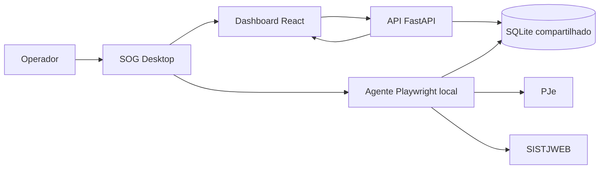

# SOG

Sistema para controlar e emitir guias finais de custas processuais no TJDFT.

O SOG combina automação local, API, dashboard web e runtime desktop para apoiar
o operador na triagem, acompanhamento, revisão humana e emissão de guias. Como o
sistema lida com regras de custas e ações auditáveis, trate regras de negócio,
transições de status, logs e dados persistidos como partes críticas do domínio.

## Componentes

- `agente/`: automação Python/Playwright para PJe, SISTJWEB e integrações auxiliares.
- `api/`: backend FastAPI do dashboard operacional.
- `frontend/`: dashboard React para ciclo atual, fila, detalhe e histórico.
- `shared/`: acesso compartilhado ao SQLite e contratos comuns entre agente e API.
- `nginx/`: ponto de entrada HTTP do Compose.
- `desktop/`: instalador/app Electron para operadores, com Docker guiado e agente
  Playwright local.
- `packages/sogtj/`: bootstrap npm usado pelo comando `npx -y sogtj`.

## Arquitetura Operacional



## Estado Atual

O dashboard já controla o agente por API e SQLite, com suporte a:

- autenticação por cookies `httpOnly`;
- comandos `iniciar` e `parar` do agente;
- acompanhamento do ciclo atual e do último ciclo;
- reprocessamento de processos elegíveis;
- screenshot autenticado por processo;
- fila, detalhe e histórico no frontend.

O caminho recomendado para usuário final é o SOG Desktop:

- API, frontend e nginx rodam em Docker Desktop;
- o agente Playwright roda fora do container para abrir Chromium visível;
- o dashboard desktop roda apenas em `localhost` e não exige login próprio;
- PJe e SISTJWEB continuam com login manual por SSO/2FA, sem armazenamento de senha;
- `docker-compose.desktop.yml` remove o container `agente` do fluxo de usuário
  final e preserva os dados em `%LOCALAPPDATA%/SOG/dados`.

## Instalação no Windows com `npx`

Este é o caminho recomendado para instalar o iSOG/SOG Desktop em uma máquina
Windows de usuário final. O comando `npx` baixa e abre o instalador oficial; o
instalador configura o aplicativo local, sobe o sistema em containers Docker e
abre o dashboard no navegador.

### Requisitos do Usuário

- Windows 11 com permissão para instalar aplicativos.
- Internet liberada para baixar o instalador, Docker Desktop e imagens Docker.
- Node.js LTS instalado, para disponibilizar o comando `npx`.
- Docker Desktop instalado ou permissão para instalá-lo durante o assistente do
  iSOG/SOG Desktop.
- Chrome instalado se o usuário quiser usar o dashboard especificamente no
  Chrome. Por padrão, o aplicativo abre o navegador padrão do Windows.

### Passo a Passo

1. Abra o PowerShell no Windows.
2. Execute:

   ```powershell
   npx -y sogtj
   ```

3. Aguarde o download e a abertura do instalador do iSOG/SOG Desktop.
4. Siga o assistente de instalação e mantenha a criação do atalho quando
   oferecida.
5. Abra o iSOG/SOG Desktop pelo Menu Iniciar ou pelo atalho criado.
6. Se o Docker Desktop ainda não estiver instalado, use a ação indicada pelo
   aplicativo para instalar o Docker Desktop. Depois da instalação, abra o Docker
   Desktop e aguarde ele ficar em execução.
7. No iSOG/SOG Desktop, confirme as configurações iniciais e inicie a stack do
   sistema. O dashboard local não pede uma senha própria.
8. O aplicativo subirá os containers Docker locais do SOG, incluindo API,
   frontend e nginx.
9. Quando a stack estiver pronta, o dashboard será aberto no navegador padrão em
   `http://localhost` ou na porta configurada no assistente.
10. Se quiser usar o Chrome e ele não abrir automaticamente, defina o Chrome como
    navegador padrão do Windows ou copie a URL do dashboard para o Chrome.

Os dados locais do usuário ficam em `%LOCALAPPDATA%/SOG/dados`. O dashboard e a
API rodam localmente dentro dos containers Docker; o agente Playwright roda pelo
aplicativo desktop para permitir login manual nos sistemas externos quando
necessário.

## Execução Local com Docker

Crie os arquivos de ambiente a partir do exemplo:

```bash
cp .env.example .env.api
cp .env.example .env.agente
```

Revise os blocos correspondentes dentro de `.env.example` antes de subir o
Compose. Em especial:

- no SOG Desktop, o dashboard local roda com `DASHBOARD_AUTH_DISABLED=true` e
  porta presa a `127.0.0.1`; o usuário final não precisa criar senha local nem
  editar `.env`;
- em execução manual fora do instalador, a configuração técnica do dashboard
  precisa ser preenchida no `.env.api`;
- `JWT_SECRET_KEY` precisa ter pelo menos 32 caracteres;
- PJe e SISTJWEB usam login interativo; não há usuário/senha desses sistemas no
  `.env`;
- Telegram é tratado como obrigatório para homologação local do agente.

Suba o Compose principal:

```bash
docker-compose up -d --build
```

Para desenvolvimento com Compose dev:

```bash
docker-compose -f docker-compose.dev.yml up -d --build
```

URLs úteis:

| Ambiente | URL | Observação |
|---|---|---|
| Compose principal | <http://localhost> | entrada via nginx |
| Compose principal | <http://localhost/api/v1/health> | health da API via nginx |
| Compose dev | <http://localhost:8080> | nginx dev |
| Compose dev | <http://localhost:3001> | frontend Vite |

## Desenvolvimento Fora do Docker

### API

```bash
cd api
pip install -r requirements.txt
pip install -e ../shared
uvicorn src.app:app --reload --port 8000
```

### Agente

```bash
cd agente
pip install -r requirements.txt
pip install -e ../shared
playwright install chromium
python src/servico.py
```

### Frontend

```bash
cd frontend
npm install
npm run dev
```

## Build do Desktop

Para gerar o instalador Windows a partir do pacote `desktop/`:

```powershell
cd desktop
npm install
npm run build:win
```

O instalador gerado abre uma interface gráfica para configurar o SOG, guiar a
instalação do Docker Desktop quando ausente, subir a stack e iniciar o agente
local. A interface também permite reiniciar a stack Docker e mudar a porta do
dashboard quando a porta 80 estiver ocupada.

## Fluxo Operacional Resumido

1. O operador acessa o dashboard. No SOG Desktop local não há login próprio do
   dashboard; em execução manual, o login do dashboard segue a configuração do
   `.env.api`.
2. O frontend consulta `/api/v1/auth/me` e usa o modo informado pela API.
3. O dashboard envia comandos para `/api/v1/agente/iniciar` ou
   `/api/v1/agente/parar`.
4. A API grava o controle no SQLite compartilhado.
5. O agente processa ciclos, filas e tarefas assíncronas, atualizando tabelas de
   `processos`, `agente_controle`, `agente_ciclos`, `agente_ciclo_membros` e
   `tarefas`.

## Testes

```bash
pytest agente/tests/ api/tests/ -v
cd frontend && npm test
```

## Documentação Canônica

- [docs/README.md](docs/README.md): mapa da documentação e classificação de artefatos históricos.
- [docs/architecture.md](docs/architecture.md): componentes, fluxo e persistência.
- [docs/api.md](docs/api.md): autenticação, rotas principais e estados.
- [docs/distribuicao-npx-sogtj.md](docs/distribuicao-npx-sogtj.md): distribuição do iSOG via `npx`.
- [docs/operacao-local-docker.md](docs/operacao-local-docker.md): execução local em Docker e limitações.
- [docs/instalador-desktop.md](docs/instalador-desktop.md): instalador gráfico, runtime desktop e fluxo do operador.
- [frontend/README.md](frontend/README.md): visão do dashboard e experiência atual de frontend.

## Limites e Ambiguidades Conhecidas

- `docs/regras_custas_tjdft.md` é um template de coleta manual, não uma verdade
  homologada de regra de negócio.
- `docs/PRD.md` permanece como artefato de origem/histórico.
- A persistência do `storage_state` do Playwright não está descrita de forma
  consistente entre código e Compose; veja a nota em
  `docs/operacao-local-docker.md`.
